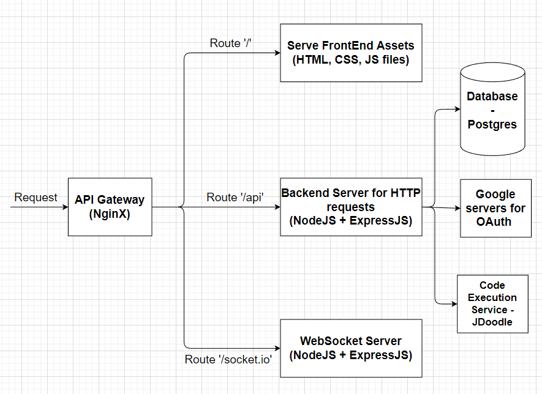

# Code-Collaboration   
### Realtime Code Collaboration.
Live at http://ec2-13-232-32-212.ap-south-1.compute.amazonaws.com/

### Built With

* Node.js
* Express.js
* Javascript
* React.js
* NginX
* Docker
* PostgreSQL

## Features
*  Users can sign up & then login to the application. {Authentication}
*  Users will also have an option to create new meetings. Upon creation user will be provided with a meeting code which can be shared to other participants.
*   On the meeting page, we’ll have ->
    - Code Editor with supported languages {C++, Java, Python for beginning}
    - Option to add Test Cases
    - Option to run code on given test cases
    - Participants & their videos {Not yet implemented}
    - Fetch Question From Leetcode API & display it on the screen. {Not yet implemented}
    - Submit Problem on Leetcode {If Possible}
    - Option to exit the meeting.
    - Option to end the meeting provided only to the user who started the meeting. 
* Authentication
    - Available options-
      - Username Password Based
      - Passwordless - OTP/link sent to the user's Email id every time a user tries to login.
      - OAuth {Google, Github, LinkedIn etc.}
    - Best Option is Google OAuth since most people have a Google Account. Also OAuth saves us from the trouble of managing user Passwords which is sensitive information. Along with this, it is better for the users since they won't have to remember yet another password.
    - Google OAuth flow can be implemented using the PassportJS library.

## App Architecture
  - API Gateway/Reverse Proxy -> All the requests to be made to the application will be made to the gateway which will act as Reverse Proxy & route the requests to appropriate servers based on the URL.
  - Backend Server -> This is our main server that will handle all the data flow & all HTTP requests will be made to this server.
  - Websocket Server -> This will allow real time code sharing between the clients. Whenever the gateway receives a request at ‘/websocket’ it will upgrade the connection between gateway & client from HTTP to Websocket. It also needs to communicate with the backend server to store meeting details.
  - FrontEnd Application -> This will serve out frontend assets when request is made to ‘/’ route.
  - Code Execution Service -> Using a Third Party Service named JDoodle which gives daily 200 free code submissions. For scaling the app this service must be built in-house.

  

## Contributing
Contributions are welcome! If you find any issues or have suggestions for improvement, please create an issue or submit a pull request

## Contact

If you have any questions or need further assistance, please feel free to contact me at skjnv2009@gmail.com.
